<div align="center">

# ⚒️ NicheForge


### *Forge Your Own Domain Expert AI in Minutes*

[](https://opensource.org/licenses/MIT)
[](https://www.python.org/downloads/)
[](https://streamlit.io)
[](https://www.docker.com/)
[](http://makeapullrequest.com)

**Transform any documentation into a specialized AI assistant with automated data generation, efficient fine-tuning, and production-ready deployment.**

[Quick Start](#-quick-start) • [Features](#-features) • [Architecture](#-architecture) • [Documentation](#-workflow-guide) • [Contributing](#-contributing)

</div>

---

## 🎯 What is NicheForge?

NicheForge is a complete **end-to-end MLOps pipeline** that democratizes the creation of domain-specific AI experts. Whether you're building an assistant for your company's internal documentation, a specialized coding helper, or a customer support bot, NicheForge handles the entire workflow:

```
📄 Raw Docs → 🤖 Synthetic Data → 🧠 Fine-Tuned Model → 💬 Production Chat UI
```

**Current Demo**: A Polars DataFrame library expert trained on official documentation.

---

## ✨ Features

### 🔄 **Intelligent Data Pipeline**
- **Automated Scraping**: Extract content from documentation websites
- **LLM-Powered Generation**: Uses Ollama/Mistral to create high-quality instruction-response pairs
- **Incremental Processing**: Saves progress after each file to prevent data loss
- **Smart Chunking**: Optimally splits large documents for better context

### 🧠 **Efficient Fine-Tuning**
- **Unsloth Integration**: 2x faster training, 60% less VRAM usage
- **LoRA Adapters**: Parameter-efficient fine-tuning (train 8B models on free T4 GPUs)
- **Google Colab Ready**: Pre-configured notebook for zero-setup training
- **One-Click Download**: Automatically packages and downloads trained adapters

### 🎨 **Production-Grade UI**
- **Modern Dark Theme**: Professional Slate-based design with Inter typography
- **Real-Time Status**: Live backend indicator (Local/Ollama/Mock)
- **Streaming Responses**: Typing effect for natural conversation flow
- **Responsive Layout**: Works seamlessly on desktop and mobile

### 🛡️ **Robust Inference**
- **Auto-Detection**: Intelligently selects best available backend
- **Graceful Degradation**: Falls back through Local → Ollama → Mock
- **Hot-Swappable**: Drop in a new adapter without code changes
- **Error Handling**: Comprehensive logging and user-friendly error messages

### 🐳 **DevOps Ready**
- **Dockerized**: Single-command deployment with docker-compose
- **Environment Agnostic**: Runs on Windows, Linux, macOS
- **Scalable**: Easy to integrate with cloud platforms (AWS, GCP, Azure)

---

## 🏗️ Architecture

```mermaid
graph LR
    A[📄 Raw Documentation] -->|Scraper| B[📝 Text Files]
    B -->|Generator + Ollama| C[💾 dataset.json]
    C -->|Upload to Colab| D[☁️ GPU Training]
    D -->|Unsloth + LoRA| E[🎯 Fine-Tuned Adapter]
    E -->|Download| F[💻 Local Deployment]
    F -->|Inference Engine| G[💬 Streamlit UI]
    H[🔵 Ollama Baseline] -.->|Fallback| F
    I[🟠 Mock Mode] -.->|Fallback| F
    
    style C fill:#3b82f6
    style E fill:#22c55e
    style G fill:#f59e0b
```



### Tech Stack
- **Frontend**: Streamlit with custom CSS
- **Backend**: Python 3.10+, FastLanguageModel (Unsloth)
- **LLM**: Llama-3 8B (4-bit quantized)
- **Data Gen**: Ollama (Mistral/Llama)
- **Training**: Google Colab (free T4 GPU)
- **Deployment**: Docker + Docker Compose

---

## 🚀 Quick Start

### Prerequisites
- Python 3.10 or higher
- [Ollama](https://ollama.com/) installed and running (`ollama serve`)
- (Optional) Docker for containerized deployment

### Option 1: Local Setup (5 minutes)

```bash
# 1. Clone the repository
git clone https://github.com/YatindraRai002/NicheForge.git
cd NicheForge

# 2. Install dependencies
pip install -r requirements.txt

# 3. Pull the base model for data generation
ollama pull mistral

# 4. Launch the application
python -m streamlit run app.py
```

Open your browser to **http://localhost:8501** 🎉

### Option 2: Docker (1 minute)

```bash
# Start everything with one command
docker-compose up --build
```

---

## 📖 Workflow Guide

### Step 1: Generate Training Data 🧬

Place your documentation files (`.txt`, `.md`) in the `raw_data/` folder, then run:

```bash
python dataset_generation/generator.py
```

**What happens:**
- Reads all text files from `raw_data/`
- Chunks content into digestible pieces (2000 chars)
- Prompts Ollama to generate instruction-response pairs
- Saves incrementally to `dataset.json`

**Example Output:**
```json
[
  {
    "instruction": "How do I create a DataFrame in Polars?",
    "input": "",
    "output": "You can create a DataFrame using `pl.DataFrame(data)`, where data is a dictionary or list..."
  }
]
```

### Step 2: Fine-Tune Your Model 🏋️

We recommend Google Colab for free GPU access:

1. **Open Notebook**: Upload `fine_tuning/FineTuning_Colab.ipynb` to [Google Colab](https://colab.research.google.com/)
2. **Upload Data**: Drag `dataset.json` into the Colab file browser
3. **Select GPU**: Runtime → Change runtime type → T4 GPU
4. **Run All**: Click Runtime → Run all
5. **Download**: The last cell auto-downloads `lora_model.zip`

**Training Time**: ~10-15 minutes for 100 examples on T4

### Step 3: Deploy Your Expert 🚀

```bash
# Unzip the trained adapter
unzip lora_model.zip

# Restart the app (it will auto-detect the new model)
python -m streamlit run app.py
```

The UI will show a **🟢 Green Dot** indicating your custom model is active!

---

## 🎯 Use Cases

- **Internal Documentation Assistant**: Train on company wikis, API docs, or knowledge bases
- **Code Helper**: Specialize in your framework (React, Django, FastAPI)
- **Customer Support**: Answer FAQs based on your product documentation
- **Educational Tutor**: Create subject-specific learning assistants
- **Research Assistant**: Train on academic papers in your field

---

## 📂 Project Structure

```
NicheForge/
├── 📱 app.py                      # Streamlit UI (main entry point)
├── 🧠 inference.py                # Model loading & fallback logic
├── 🐳 Dockerfile                  # Container definition
├── 🎼 docker-compose.yml          # Multi-service orchestration
├── 📋 requirements.txt            # Python dependencies
├── 📖 README.md                   # This file
├── 💾 dataset.json                # Generated training data
├── 🎯 lora_model/                 # Fine-tuned adapter (after training)
│
├── 📁 raw_data/                   # Source documentation
│   └── *.txt                      # Place your docs here
│
├── 🔧 dataset_generation/
│   ├── scraper.py                 # Web scraping utility
│   └── generator.py               # Data generation pipeline
│
├── 🏋️ fine_tuning/
│   ├── FineTuning_Colab.ipynb    # Colab training notebook
│   └── train.py                   # Local training script
│
└── 📊 evaluation/
    ├── evaluate.py                # Benchmark runner
    ├── judge.py                   # LLM-as-a-Judge scorer
    └── test_set.json              # Ground truth Q&A
```

---

## 🎨 UI Preview

The NicheForge interface features:
- **Clean Dark Mode**: Professional Slate color palette
- **Live Status Indicators**: Know which backend is active at a glance
- **Smooth Animations**: Typing effects and transitions
- **Responsive Design**: Works on all screen sizes

---

## 🔧 Configuration

### Backend Priority
The inference engine automatically selects the best available option:

| Priority | Backend | Requirements | Indicator |
|----------|---------|--------------|-----------|
| 1 | **Local Adapter** | `lora_model/` exists + Unsloth installed | 🟢 Green |
| 2 | **Ollama** | Ollama running on localhost:11434 | 🔵 Blue |
| 3 | **Mock** | None (always available) | 🟠 Orange |

### Environment Variables
Create a `.env` file for customization:

```bash
OLLAMA_HOST=http://localhost:11434
MODEL_NAME=mistral
TEMPERATURE=0.7
MAX_TOKENS=512
```

---

## 🧪 Evaluation

Benchmark your model's performance:

```bash
# Run evaluation on test set
python evaluation/evaluate.py

# Score with LLM-as-a-Judge
python evaluation/judge.py
```

Results are saved to `evaluation/judge_report.json` with detailed scoring.

---

## 🤝 Contributing

We welcome contributions! Here's how to get started:

1. **Fork** the repository
2. **Create** a feature branch (`git checkout -b feature/AmazingFeature`)
3. **Commit** your changes (`git commit -m 'Add AmazingFeature'`)
4. **Push** to the branch (`git push origin feature/AmazingFeature`)
5. **Open** a Pull Request

### Development Guidelines
- Follow PEP 8 style guide
- Use `black` for code formatting
- Add docstrings to new functions
- Update `requirements.txt` if adding dependencies

---

## 🐛 Troubleshooting

**Q: "Ollama not found" error**  
A: Make sure Ollama is installed and running (`ollama serve`). Check with `ollama list`.

**Q: Training fails with CUDA out of memory**  
A: Use the Colab notebook instead of local training, or reduce `per_device_train_batch_size` in `train.py`.

**Q: Model responses are generic**  
A: You may need more training data (aim for 200+ examples) or increase `max_steps` during fine-tuning.

**Q: Streamlit won't start**  
A: Try `python -m streamlit run app.py` instead of just `streamlit run app.py`.

---

## 📜 License

This project is licensed under the **MIT License** - see the [LICENSE](LICENSE) file for details.

---

## 🙏 Acknowledgments

- **[Unsloth](https://github.com/unslothai/unsloth)** - For making LLM fine-tuning accessible
- **[Ollama](https://ollama.com/)** - For local LLM inference
- **[Streamlit](https://streamlit.io/)** - For the amazing UI framework
- **[Polars](https://pola.rs/)** - Demo dataset source

---

<div align="center">

**Built with ❤️ by the NicheForge Community**

[⭐ Star this repo](https://github.com/YatindraRai002/NicheForge) • [🐛 Report Bug](https://github.com/YatindraRai002/NicheForge/issues) • [💡 Request Feature](https://github.com/YatindraRai002/NicheForge/issues)

</div>
